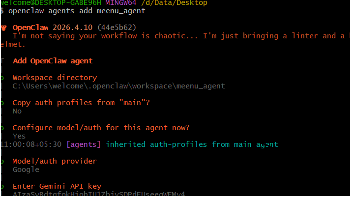
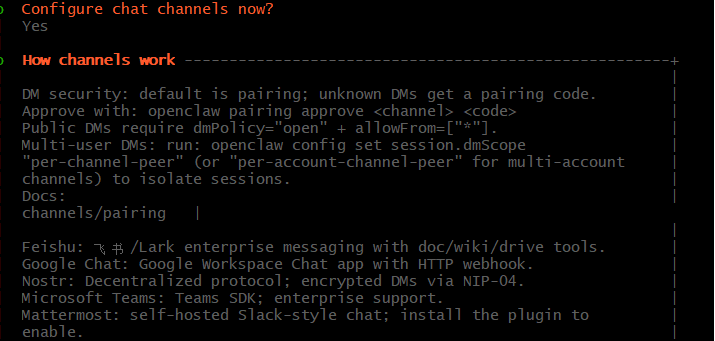
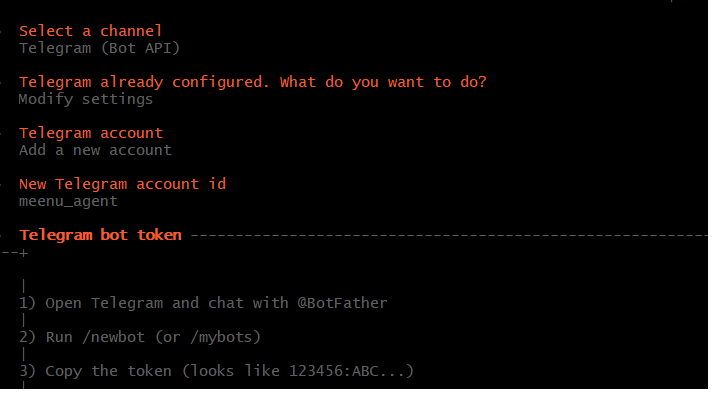
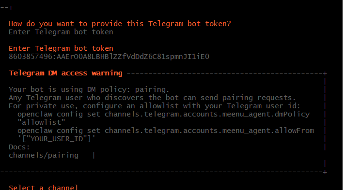
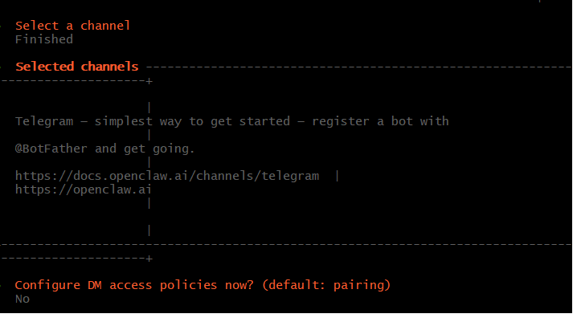
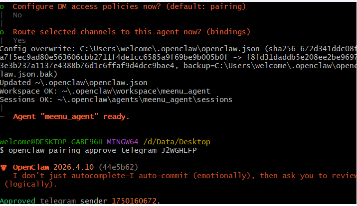

# Vital_Commands


## Openclaw Commands ##

WebURL for Openclaw
```
openclaw dashboard --no-open
```

Launch Openclaw from Ollama
```
ollama launch openclaw --model deepseek-v3.1:671b-cloud
```

```
openclaw agents add <name>
```














ssh -i "D:\Data\Downloads\Openclaw_test.pem" ubuntu@65.1.149.164

Commands provide permission on the file so local access can be enabled

```
icacls "D:\Data\Downloads\Openclaw_test.pem" /inheritance:r
icacls "D:\Data\Downloads\Openclaw_test.pem" /grant:r "%USERNAME%:R"
```

ssh -i "D:\Data\Downloads\Openclaw_test.pem" ubuntu@65.1.149.164

ssh -i "D:\Data\Downloads\Openclaw_test.pem" -N -L 18789:127.0.0.1:18789 ubuntu@65.1.149.164

